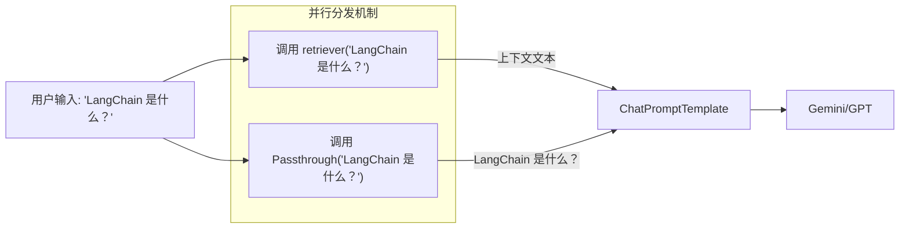

# LangChain 组件详解：RunnablePassthrough

在 LangChain LCEL (LangChain Expression Language) 的世界里，数据像水流一样在管道（Pipe `|`）中流动。通常，一个组件会处理输入并产生新的输出，传递给下一个组件。

但是，有时候我们需要**保留原始输入**，或者将输入**原样传递**给后续步骤。这时，`RunnablePassthrough` 就登场了。

## 1. 什么是 RunnablePassthrough？

`RunnablePassthrough` 是一个极其简单的 Runnable，它的作用就是：**透传**。

*   **输入**：`x`
*   **输出**：`x`

简单来说，它就像一个**占位符**或**连接器**，不做任何修改，直接把拿到的数据递给后面。

## 2. 为什么需要它？

你可能会问：如果它什么都不做，为什么需要它？

核心应用场景有两个：
1.  **数据多路复用（Forking）**：在并行处理（`RunnableParallel`）中，我们需要把同一个输入同时传给多个分支。其中一个分支可能需要处理数据（比如检索），而另一个分支需要保留原始数据（比如填入 Prompt）。
2.  **构建字典**：在构建 Prompt 输入时，我们通常需要一个字典（例如 `{"context": ..., "question": ...}`）。`RunnablePassthrough` 允许我们在构建字典时引用“整个输入”。

## 3. 核心应用场景：RAG (检索增强生成)

这是 `RunnablePassthrough` 最经典的使用场景。

### 3.1 场景描述
在 RAG 中，我们需要做两件事：
1.  拿用户的问题去检索文档 -> 生成 `context`。
2.  把用户的问题直接填入 Prompt -> 生成 `question`。

### 3.2 代码实现详解

让我们看一段模拟代码（完整代码见 `src/examples/chains/demo_runnable_passthrough.py`）：

```python
rag_chain = (
    {
        "context": retriever,          # 分支 1：处理输入，生成 context
        "question": RunnablePassthrough() # 分支 2：原样透传，生成 question
    }
    | prompt
    | llm
)
```

### 3.3 数据流深度解析 (参数是如何传递的？)

很多同学会问：**`retriever`（比如 `fake_retriever`）的参数是从哪来的？**

当您执行 `rag_chain.invoke("什么是 LangChain?")` 时，数据流向如下：

1.  **广播 (Broadcasting)**：
    *   最外层的字典结构（隐式 `RunnableParallel`）接收到输入 `"什么是 LangChain?"`。
    *   它会将**这一份输入**，同时复制并通过 `invoke()` 方法传递给字典中的每一个 Value。

2.  **并行执行**：
    *   **分支 A ("context")**：调用 `retriever.invoke("什么是 LangChain?")`。
        *   因此，`retriever` 函数（或 Runnable）接收到的参数就是这个输入字符串。
    *   **分支 B ("question")**：调用 `RunnablePassthrough().invoke("什么是 LangChain?")`。
        *   它不做任何处理，直接返回 `"什么是 LangChain?"`。

3.  **聚合 (Aggregation)**：
    *   `RunnableParallel` 等待两个分支都执行完毕。
    *   它将结果打包成一个新的字典：`{"context": ..., "question": "..."}`。
    *   这个字典随后被传给下一个环节：`prompt`。

### 3.4 Mermaid 图解



如果没有 `RunnablePassthrough`，我们就无法在 `RunnableParallel`（那个字典结构）中引用原始的输入字符串。

## 4. 进阶用法：RunnablePassthrough.assign()

除了原样透传，它还有一个非常有用的静态方法：`.assign()`。
它用于**在不丢失原始字典数据的情况下，添加新的字段**。

### 场景
假设上一步的输出是 `{"num": 10}`，你需要计算它的平方，但同时保留 `num` 字段。

### 代码对比

**不使用 assign**:
```python
# 你需要手动构造整个字典，很容易丢失旧数据
chain = RunnableLambda(lambda x: {"num": x["num"], "squared": x["num"]**2})
```

**使用 assign (优雅)**:
```python
# 自动合并新旧数据
chain = RunnablePassthrough.assign(squared=lambda x: x["num"]**2)
```

**输出**: `{'num': 10, 'squared': 100}`

这在长链条处理中非常有用，可以像“滚雪球”一样不断给数据流增加新的上下文，而不会丢弃之前的信息。

## 5. 总结

*   **RunnablePassthrough()**: 恒等函数 `f(x) = x`。用于在并行分支中保留原始输入。
*   **RunnablePassthrough.assign(...)**: 增量更新函数 `f(dict) = dict + new_keys`。用于给字典添加新字段。

它是 LCEL 胶水代码中不可或缺的一部分，尤其是在构建 RAG 和复杂数据流时。
