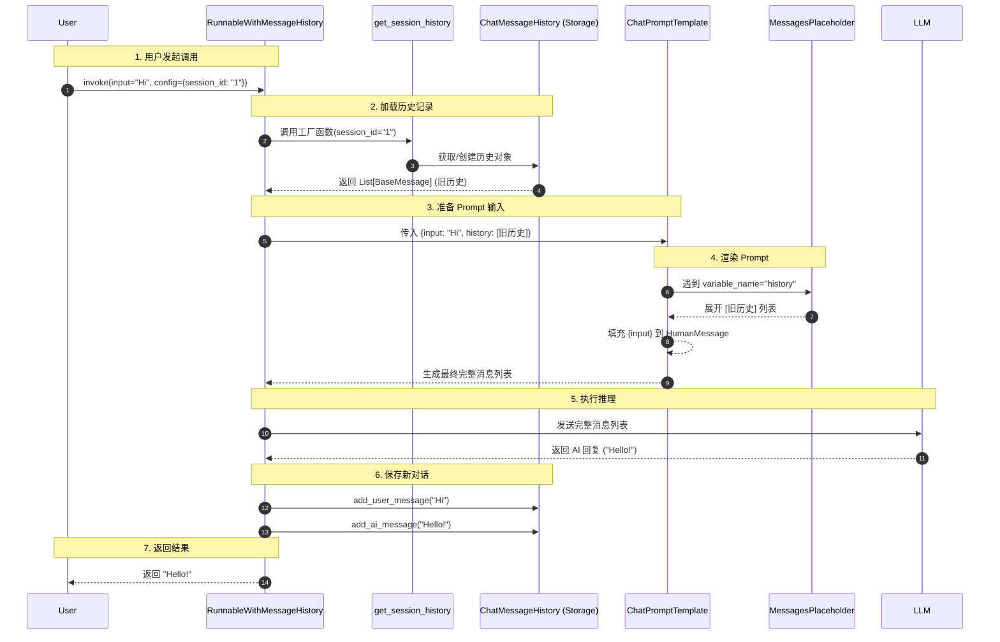

# LangChain 实战：RunnableWithMessageHistory 深度详解

在构建聊天机器人（Chatbot）时，**“记忆”（Memory）**是核心能力之一。早期的 LangChain 使用 `ConversationChain` + `Memory` 对象来管理历史，但在 LCEL（LangChain Expression Language）时代，官方推荐使用更灵活、更解耦的 **`RunnableWithMessageHistory`**。

本文将以一个完整的 Python 示例为基础，深入剖析 `RunnableWithMessageHistory` 的工作原理、核心参数及最佳实践。

## 1. 为什么需要它？

在没有 `RunnableWithMessageHistory` 之前，手动管理对话历史通常需要以下繁琐步骤：

1.  **查询**：根据 User ID 从数据库查出历史记录。
2.  **拼接**：手动把历史记录塞进 Prompt 中。
3.  **调用**：执行 LLM。
4.  **保存**：手动把 User Input 和 AI Output 追加保存回数据库。

`RunnableWithMessageHistory` 就像一个**自动化的切面（Aspect）**，它包装了你的 Chain，自动在后台完成了上述“查询-注入-保存”的所有工作，让你只需要关注当前轮次的交互。

## 2. 实战代码演示

以下是一个可运行的完整示例 (`src/examples/memory/demo_runnable_with_history.py`)。

### 2.1 准备工作

首先，我们需要定义基础组件：LLM、Prompt 以及历史记录的存储位置。

```python
from langchain_core.prompts import ChatPromptTemplate, MessagesPlaceholder
from langchain_core.runnables.history import RunnableWithMessageHistory
from langchain_community.chat_message_histories import ChatMessageHistory
from src.llm.gemini_chat_model import get_gemini_llm

# 1. 定义存储：这里使用内存字典模拟数据库
store = {}

# 2. 定义工厂函数：告诉系统如何根据 session_id 获取历史对象
def get_session_history(session_id: str):
    if session_id not in store:
        store[session_id] = ChatMessageHistory()
    return store[session_id]

# 3. 初始化 LLM
llm = get_gemini_llm()

# 4. 定义 Prompt：必须包含历史记录的占位符
prompt = ChatPromptTemplate.from_messages([
    ("system", "You are a helpful assistant."),
    MessagesPlaceholder(variable_name="history"), # <--- 关键点：预留位置
    ("human", "{input}"),
])

# 5. 创建基础 Chain
chain = prompt | llm
```

### 2.2 核心包装

这是最关键的一步。我们将无状态的 `chain` 包装成有状态的 `with_message_history`。

```python
with_message_history = RunnableWithMessageHistory(
    chain,
    get_session_history,
    input_messages_key="input",
    history_messages_key="history",
)
```

### 2.3 调用执行

调用时，我们需要通过 `config` 传递 `session_id`。

```python
# 第一轮：告诉我是 Bob
response1 = with_message_history.invoke(
    {"input": "Hi! My name is Bob."},
    config={"configurable": {"session_id": "session_1"}}
)
print(f"AI: {response1.content}")

# 第二轮：问我的名字
response2 = with_message_history.invoke(
    {"input": "What is my name?"}, 
    config={"configurable": {"session_id": "session_1"}}
)
print(f"AI: {response2.content}")
# 输出: AI: Your name is Bob. (成功记住了！)
```

## 3. 参数深度剖析 (非常重要)

`RunnableWithMessageHistory` 的构造函数接收 4 个核心参数，理解它们是掌握 LCEL Memory 的关键。

### 1. `runnable` (位置参数 1)
*   **含义**：被包装的基础对象（通常是 `Prompt | LLM` 组成的 Chain）。
*   **要求**：这个 Chain 本身必须是**无状态**的。它不知道“历史”的存在，它只知道接收一个包含消息列表的 Prompt 并输出结果。历史的注入是在它运行**之前**由包装器完成的。

### 2. `get_session_history` (位置参数 2)
*   **含义**：一个**工厂函数**（Factory Function）。
*   **签名**：`(session_id: str) -> BaseChatMessageHistory`。
*   **作用**：这是 LangChain 与外部存储（Redis, Postgres, Memory）交互的接口。
    *   当 `invoke` 开始时，系统调用此函数加载旧记录。
    *   当 `invoke` 结束时，系统调用此函数保存新记录。
*   **实战**：生产环境中，这里通常返回 `RedisChatMessageHistory` 或 `PostgresChatMessageHistory` 的实例。

### 3. `input_messages_key` (关键字参数)
*   **含义**：**“哪个 Key 代表用户的新消息？”**
*   **背景**：Chain 的输入通常是一个字典（例如 `{"input": "你好", "style": "幽默"}`）。系统需要知道要把**哪一个值**作为 `HumanMessage` 保存到历史记录中。
*   **设定**：在上面的例子中，我们调用 invoke 时用了 `{"input": "..."}`，所以这里填 `"input"`。

### 4. `history_messages_key` (关键字参数)
*   **含义**：**“历史记录应该填到 Prompt 的哪个坑里？”**
*   **背景**：在 Prompt 中，我们预留了一个占位符 `MessagesPlaceholder(variable_name="history")`。
*   **设定**：系统加载出历史记录（List[Message]）后，会自动将其注入到这个 key 中。所以这里必须填 `"history"`，以匹配 Prompt 中的变量名。

## 4. 运行流程图解

当你执行 `with_message_history.invoke({...}, config={...})` 时，内部发生了什么？

1.  **提取 ID**：从 `config` 中读取 `session_id`。
2.  **加载历史**：调用 `get_session_history(session_id)` 获取当前的历史消息列表。
3.  **注入 Prompt**：
    *   创建一个新的输入字典。
    *   将用户输入 (`input`) 放入。
    *   将历史列表 (`history`) 放入。
4.  **执行 Chain**：运行基础 Chain (`prompt | llm`)。
5.  **保存历史**：
    *   将用户的输入 (`HumanMessage`) 追加到历史对象。
    *   将 AI 的输出 (`AIMessage`) 追加到历史对象。
6.  **返回结果**：将 AI 的输出返回给用户。

## 5. 总结

`RunnableWithMessageHistory` 是 LangChain 中优雅管理状态的瑞士军刀。它通过**配置化**的方式，将繁琐的历史记录读写逻辑从业务逻辑中剥离出来，极大地简化了代码结构。

**记忆口诀**：
*   **Config** 定身份 (session_id)。
*   **Factory** 找仓库 (get_session_history)。
*   **Keys** 做映射 (input/history keys)。

## 6. 架构关系图 (Mermaid)

下图直观地展示了 `RunnableWithMessageHistory`、`get_session_history`、`MessagesPlaceholder` 和 `ChatPromptTemplate` 之间的协作关系。



**图解说明**：
1.  **RunnableWithMessageHistory** 是总指挥，负责协调所有组件。
2.  **get_session_history** 是仓库管理员，负责根据 ID 找到对应的历史记录本。
3.  **MessagesPlaceholder** 是 Prompt 里的“占位符”，负责把从仓库拿出来的历史记录“平铺”到对话中。
4.  **ChatPromptTemplate** 是最终的拼装车间，输出给 LLM 的是包含历史和新输入的完整列表。
