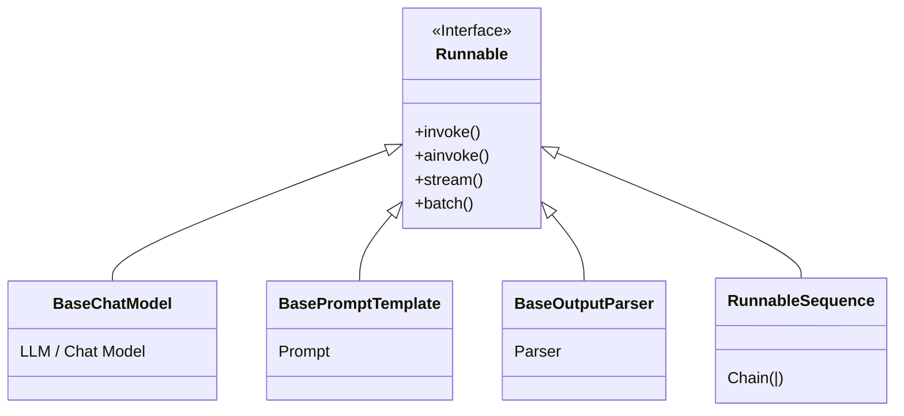
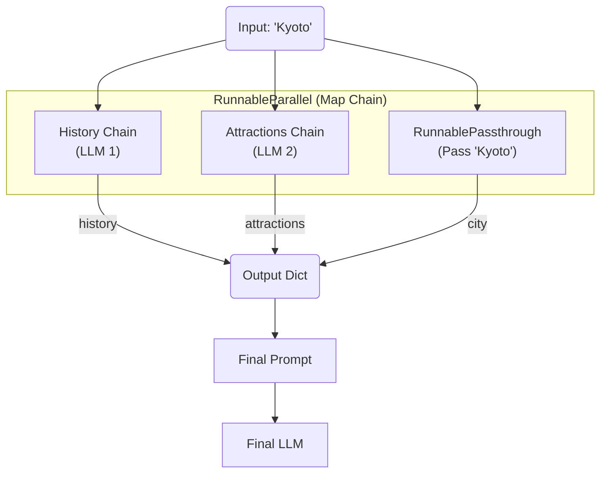

# LangChain 核心架构解析：Runnable 协议与编排原语

## 1. 概述 (Overview)

LangChain 0.1+ 架构重构的核心在于引入了 **Runnable 协议**。该协议通过定义统一的输入输出接口（IO Interface），消除了 Prompt、LLM、OutputParser 以及自定义函数之间的异构性，使得它们能够像 Unix 管道一样进行无缝组合。

本文将深入剖析 LangChain 编排层的三大核心原语：`Runnable`（基石）、`RunnableLambda`（函数封装）与 `RunnableParallel`（并发编排）。

---

## 2. Runnable 协议：万物互联的基石

`Runnable` 是 LangChain 中所有核心组件的父类。无论是 `ChatModel`、`PromptTemplate` 还是 `Chain`，本质上都是一个 `Runnable` 实例。

### 核心契约
所有的 Runnable 组件都必须实现以下核心方法：
*   `invoke(input)`: 同步单一调用。
*   `ainvoke(input)`: 异步单一调用。
*   `stream(input)`: 同步流式输出。
*   `astream(input)`: 异步流式输出。
*   `batch(inputs)`: 批量处理。

### 继承关系图谱



### 代码示例 1：组件的多态性

以下代码展示了 Prompt 和 LLM 如何作为独立的 Runnable 被调用，以及如何组合。

```python
from langchain_core.runnables import RunnableSequence
from langchain_core.prompts import PromptTemplate
from src.llm.gemini_chat_model import get_gemini_llm

llm = get_gemini_llm()
prompt = PromptTemplate.from_template("Hello, {name}!")

# 1. 单独调用 Prompt (Runnable)
# 输入: Dict, 输出: StringPromptValue
prompt_val = prompt.invoke({"name": "Alice"})
print(f"Prompt Output Type: {type(prompt_val)}") 

# 2. 单独调用 LLM (Runnable)
# 输入: String/Message, 输出: AIMessage
msg = llm.invoke("Hi")
print(f"LLM Output Type: {type(msg)}")

# 3. 组合调用 (RunnableSequence)
# 管道符 `|` 本质上是构建了一个 RunnableSequence 对象
chain = prompt | llm
result = chain.invoke({"name": "Bob"})
```

---

## 3. RunnableLambda：自定义逻辑的标准化封装

在实际工程中，仅仅依靠预置组件是不够的。我们需要在链路中插入自定义的 Python 代码（如数据清洗、API 请求、格式转换）。`RunnableLambda` 提供了将任意 Python Callable 转换为 Runnable 的能力。

### 代码示例 2：基础函数封装

```python
from langchain_core.runnables import RunnableLambda

def length_function(text: str) -> int:
    return len(text)

def multiple_function(x: int) -> int:
    return x * 2

# 将普通函数包装为 Runnable
runnable1 = RunnableLambda(length_function)
runnable2 = RunnableLambda(multiple_function)

# 串联执行
chain = runnable1 | runnable2

# Input: "Hello" -> length(5) -> multiple(10) -> Output: 10
print(chain.invoke("Hello"))
```

### 代码示例 3：处理复杂数据流

`RunnableLambda` 常与 `RunnablePassthrough` 配合，用于在不阻断主数据流的情况下注入额外数据。

```python
from langchain_core.runnables import RunnablePassthrough

def extra_metadata(info: dict) -> str:
    return f"Processed {info['data']} at server-1"

# 场景：保留原始输入，并增加一个 'meta' 字段
# assign 内部通过 RunnableLambda 执行函数，并将结果 merge 回输入字典
chain = RunnablePassthrough.assign(
    meta=RunnableLambda(extra_metadata)
)

input_data = {"data": "user_click"}
# Output: {'data': 'user_click', 'meta': 'Processed user_click at server-1'}
print(chain.invoke(input_data))
```

---

## 4. RunnableParallel：并行执行与扇出 (Fan-out)

`RunnableParallel`（在 JSON 序列化中常表现为 `RunnableMap`）用于构建有向无环图 (DAG) 中的并行分支。它接收一个输入，将其**广播 (Broadcast)** 给所有子 Runnable，并行执行后，将结果聚合为一个字典。

### 核心机制
*   **Input**: 单一对象（Dict, Str 等）。
*   **Execution**: 并发执行（Async 模式下使用 `asyncio.gather`）。
*   **Output**: Key-Value 字典，Key 为定义的参数名，Value 为对应 Runnable 的输出。

### 代码示例 4：基础并行计算

```python
from langchain_core.runnables import RunnableParallel

# 定义两个简单的处理逻辑
chain = RunnableParallel(
    # 分支 1: 原样传递
    original=RunnablePassthrough(),
    # 分支 2: 转换为大写
    upper=RunnableLambda(lambda x: x.upper()),
    # 分支 3: 计算长度
    length=RunnableLambda(lambda x: len(x))
)

# Input: "langchain"
# 所有分支并行运行
result = chain.invoke("langchain")

# Output: {'original': 'langchain', 'upper': 'LANGCHAIN', 'length': 9}
print(result)
```

### 代码示例 5：RAG 场景中的检索与生成

这是 `RunnableParallel` 最典型的应用场景：同时准备 Prompt 所需的多个上下文（Context）。

```python
# 假设 retrieval_chain 是一个搜索文档的 Runnable
# 假设 memory_chain 是一个加载历史记录的 Runnable

# 构建上下文层
context_layer = RunnableParallel(
    context=retrieval_chain,  # 这里的输入是用户 question
    history=memory_chain      # 这里的输入也是用户 question
)

# 构建完整 RAG 链路
# 数据流: question -> {context, history} -> prompt -> llm
rag_chain = (
    context_layer 
    | PromptTemplate.from_template("Context: {context}, History: {history}, Q: {question}")
    | llm
)
```

### 4.1 语法糖与自动转换 (Coercion)

LangChain 提供了强大的 **Coercion（强制转换）** 机制。在 `RunnableParallel` 或 Chain 中，您**不需要**显式地使用 `RunnableLambda` 包装每一个函数。直接传入 Python 函数或 Lambda 表达式，框架会自动处理。

上面的“代码示例 4”可以简化为：

```python
# 极简写法
chain = RunnableParallel(
    original=RunnablePassthrough(),
    upper=lambda x: x.upper(),  # 自动转换为 RunnableLambda
    length=len                  # 直接使用内置函数
)
```

这种写法不仅代码更少，而且可读性更高。

### 4.2 深度解析：RunnableParallel vs 手动函数

您可能会问：“为什么不直接写一个函数返回字典，而要用 `RunnableParallel`？”

```python
# 手动函数方式 (不推荐用于复杂场景)
def manual_func(x):
    return {
        "upper": x.upper(),
        "length": len(x)
    }
```

虽然功能相似，但 `RunnableParallel` 具有关键的工程优势：

1.  **自动并发 (Automatic Concurrency)**：
    在异步调用 (`ainvoke`) 时，`RunnableParallel` 会自动利用 `asyncio.gather` 并发执行所有分支。如果您使用手动函数，除非您显式编写复杂的 async 代码，否则代码通常是串行执行的。这对于包含 IO 操作（如 API 调用、数据库查询）的分支至关重要。

2.  **可视化与追踪 (Observability)**：
    在 LangSmith 等监控工具中，`RunnableParallel` 会被渲染为并行的 DAG 节点，您可以清晰地看到每个分支的输入、输出和耗时。而手动函数只是一个黑盒，无法监控内部细节。

### 4.3 深度解析：类型、返回值与并发机制

在使用 `RunnableParallel` 时，有两个常见的概念误区需要澄清：

#### (1) 构建时 vs 运行时
*   **代码本身 (`RunnableParallel(...)`) 返回的是：一个 Runnable 对象 (Chain)**。
    它是一个待执行的逻辑单元，此时并未运行。
*   **调用后 (`.invoke(...)`) 返回的是：一个 Dict (字典)**。
    这是执行后的结果聚合。

#### (2) 并发机制：多线程 vs 异步 IO
LangChain 的设计确保了无论是在同步还是异步环境下，`RunnableParallel` 都能利用并发优势：

*   **调用 `.ainvoke()` (异步)**：
    *   **核心机制**：基于 **`asyncio`** 的异步 IO。
    *   **性能**：单线程事件循环，无线程切换开销，适合高并发 IO 场景。
*   **调用 `.invoke()` (同步)**：
    *   **核心机制**：基于 **`ThreadPoolExecutor`** 的多线程。
    *   **性能**：利用多线程处理 IO 密集型任务（如 API 调用），即使在同步代码中也能实现并行加速。

---

## 5. 综合实战案例：智能旅行规划助手

为了更直观地理解 `RunnableParallel` 和 `RunnablePassthrough` 如何协同工作，我们以 `src/examples/chains/demo_chain_complex.py` 中的代码为例。

这个场景需要同时完成两个独立的任务（查询历史、查询景点），并将结果与原始输入一起传递给最终的生成步骤。

### 5.1 数据流设计



### 5.2 核心代码实现

```python
# 1. 定义子链路
# 它们接收 city 字符串，返回处理后的字符串
history_chain = prompt_a | llm | StrOutputParser()
attractions_chain = prompt_b | llm | StrOutputParser()

# 2. 构建并行层 (RunnableParallel)
map_chain = RunnableParallel(
    history=history_chain,          # 任务 A
    attractions=attractions_chain,  # 任务 B
    city=RunnablePassthrough()      # 关键点：透传原始输入
)

# 3. 最终整合
# final_prompt 需要三个变量：{history}, {attractions}, {city}
# 这里的 map_chain 输出的字典正好满足这个需求
full_chain = map_chain | final_prompt | llm | StrOutputParser()
```

### 5.3 关键技术点解析

1.  **`RunnablePassthrough()` 的作用**：
    如果没有这一行，`RunnableParallel` 只会输出 `history` 和 `attractions`。但是最终的 Prompt (`final_prompt`) 还需要知道城市名字 (`{city}`) 来生成标题。
    `RunnablePassthrough()` 就像一条“直通管道”，它把最开始输入的 `"Kyoto"` 原封不动地传递到了输出字典的 `city` 键中，解决了**上下文丢失**的问题。

2.  **字典聚合**：
    `map_chain` 执行完毕后，会自动将所有分支的结果聚合为一个字典。这正是 `RunnableParallel` 的核心职责——**将并行的多路流合并为结构化的数据上下文**。

---

## 6. 总结

LangChain 的架构设计体现了典型的**组合式编程 (Composable Programming)** 思想。

*   **Runnable**：定义了统一的 IO 标准，打破了组件间的壁垒。
*   **RunnableLambda**：提供了扩展性，允许开发者将自定义逻辑“标准化”。
*   **RunnableParallel**：提供了并发能力，使得复杂的数据流拓扑成为可能。

通过这三个原语的排列组合，开发者可以构建出任意复杂的 LLM 应用逻辑，同时享受到框架提供的类型检查、流式传输和可观测性支持。
