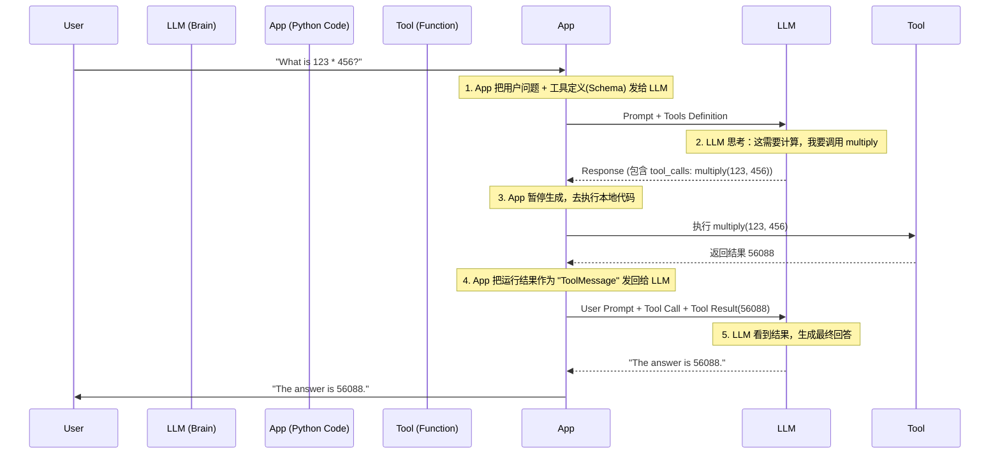

# Tool Calling 与 Function Call 深度指南

本文档将带你深入理解 AI Agent 的核心机制：如何让大模型连接外部世界。我们将从最基础的概念出发，一步步揭示技术背后的原理。

---

## 1. 什么是 Tool Calling (工具调用)？

**核心定义**：
Tool Calling 是指赋予大语言模型（LLM）使用**外部工具**的能力。
如果说 LLM 是一个博学的“大脑”，那么 Tool Calling 就是给它装上了“手”和“眼睛”。

### 1.1 为什么 LLM 需要工具？(The Why)
LLM 本质上是一个“文本生成器”，它有三大先天缺陷，必须通过使用工具来弥补：

1.  **无法获取实时信息**：
    *   *痛点*：它的知识截止于训练结束的那一天（比如不知道今天的股价）。
    *   *工具*：搜索引擎、天气 API、股票接口。
2.  **数学与逻辑短板**：
    *   *痛点*：它是基于概率预测下一个字的，做算术题经常瞎编（幻觉）。
    *   *工具*：计算器、Python 解释器。
3.  **无法与世界交互**：
    *   *痛点*：它只能生成文字，不能真正地“做事”（副作用）。
    *   *工具*：发邮件 API、数据库写入接口、智能家居控制器。

---

## 2. 实现 Tool Calling 的两种方式

既然 Tool Calling 是目的，那么我们该如何实现它呢？主要有两种技术路线：

### 方式 A：Prompt Engineering (提示词工程)
这是在早期模型（如 GPT-3）中常用的方法，也称为 **ReAct 模式**。
*   **做法**：在 System Prompt 里写死规则：“如果你要用工具，请按这个格式输出：`Action: search, Action Input: query`”。
*   **缺点**：非常不稳定。模型经常忘记格式，或者输出少个括号，导致程序无法解析。

### 方式 B：Function Calling (函数调用)
这是现代模型（如 GPT-4, Gemini）引入的**原生能力**。
*   **做法**：直接把工具的定义（JSON Schema）传给模型 API。
*   **优点**：模型经过专门训练（Fine-tuning），能**百分之百**输出符合语法的结构化数据（JSON）。
*   **结论**：**Function Call 是实现 Tool Calling 的最佳实践。**

---

## 3. 深入解析：Function Call 技术原理

Function Call 本质上解决了“自然语言”到“机器指令”的翻译问题。

**关键认知**：
> **LLM 永远不会自己执行代码。**
> 当触发 Function Call 时，LLM 只是生成了一个**文本指令（JSON）**。
> 真正执行代码的，依然是你的 Python/Java 后端。

### 3.1 核心工作流程 (Workflow)

这是一个 **"LLM - 代码 - LLM"** 的三明治结构。



### 3.2 数据结构解密 (Under the Hood)

当我们说“定义工具”时，到底发给了 LLM 什么？通常是 **JSON Schema**。

**发送给 LLM 的工具定义：**
```json
{
  "name": "multiply",
  "description": "Multiplies two integers.",
  "parameters": {
    "type": "object",
    "properties": {
      "a": { "type": "integer" },
      "b": { "type": "integer" }
    },
    "required": ["a", "b"]
  }
}
```

**LLM 返回的调用指令：**
```json
{
  "tool_calls": [
    {
      "name": "multiply",
      "arguments": "{\"a\": 123, \"b\": 456}"
    }
  ]
}
```

---

## 4. 技术演进与未来

1.  **ReAct 时代**：靠 Prompt 苦苦支撑，极不稳定。
2.  **Native Function Calling**：模型微调，稳定性大增，成为行业标准。
3.  **Agents (智能体)**：能够自主规划、连续多轮调用工具，完成复杂任务。
4.  **MCP (Model Context Protocol)**：未来的通用标准。它像 USB 协议一样，定义了数据和工具的接口标准，让 AI 能即插即用地连接任何系统。

---

## 5. 实战示例对比

我们在 `src/examples/function_call/` 下提供了三种实现方式的对比。以下是每种方式的完整代码及深度解析。

### 示例 1: LangChain Native 方式 (推荐)

这是现代 AI 应用开发的标准做法，利用 LangChain 封装好的接口，代码最简洁，兼容性最好。

**文件**: `src/examples/function_call/demo_with_function_call.py`

```python
import src.configs.config
from loguru import logger
from langchain_core.tools import tool
from src.llm.gemini_chat_model import get_gemini_llm

# 1. 定义工具 (使用 @tool 装饰器)
@tool
def multiply(a: int, b: int) -> int:
    """Multiplies two integers."""
    return a * b

# 2. 初始化 LLM
llm = get_gemini_llm()

# 3. 绑定工具 (Native Function Calling)
# 这会把工具的 schema 转换为 Gemini API 能理解的格式 (Function Declaration)
llm_with_tools = llm.bind_tools([multiply])

# 4. 执行
logger.info("=== Demo: Native Function Calling (bind_tools) ===")
query = "What is 123 multiplied by 456?"
logger.info(f"User Question: {query}")

response = llm_with_tools.invoke(query)

logger.info(f"LLM Response Type: {type(response)}")
logger.info(f"LLM Response Content: {response.content}")

# 5. 检查是否触发了 Function Call
if response.tool_calls:
    logger.info("Tool Call Detected!")
    for tool_call in response.tool_calls:
        logger.info(f"Tool Name: {tool_call['name']}")
        logger.info(f"Arguments: {tool_call['args']}")
        
        # 执行工具 (可选)
        if tool_call['name'] == 'multiply':
            result = multiply.invoke(tool_call['args'])
            logger.info(f"Tool Execution Result: {result}")
else:
    logger.info("No tool call detected.")
```

#### 深度代码解析

*   **`@tool`**: 
    *   **作用**: LangChain 提供的装饰器。它不仅定义了函数，还会自动提取函数的 `docstring`（文档字符串）和类型注解（Type Hints），将其转换为 LLM 能理解的 **JSON Schema** 描述。
    *   **重要性**: 文档字符串写得越好，LLM 越能准确理解何时调用这个工具。
*   **`llm.bind_tools([multiply])`**:
    *   **作用**: 这是 LangChain 的核心适配器方法。
    *   **功能**: 它将 Python 函数列表转换为特定 LLM 提供商（这里是 Google Gemini）所需的 API 格式（如 `FunctionDeclaration`）。对于 OpenAI，它会转换为 `functions` 或 `tools` 参数格式。
    *   **返回值**: 返回一个新的 `Runnable` 对象，这个对象已经“知道”了这些工具的存在。
*   **`response.tool_calls`**:
    *   **作用**: `AIMessage` 对象的一个属性。如果模型决定调用工具，这个列表会包含调用信息。
    *   **结构**: `[{'name': 'multiply', 'args': {'a': 123, 'b': 456}, 'id': '...'}]`。
    *   **优势**: 这是一个标准的 Python 字典/对象，不需要你去解析原始的 JSON 字符串，LangChain 已经帮你解析好了。

---

### 示例 2: Manual / ReAct 方式 (手动 Prompt)

这是在 Function Calling 技术出现之前的做法。虽然现在不推荐用于新模型，但了解它有助于理解 Function Call 的本质。

**文件**: `src/examples/function_call/demo_no_function_call.py`

```python
import src.configs.config
from loguru import logger
from langchain_core.prompts import ChatPromptTemplate
from src.llm.gemini_chat_model import get_gemini_llm

# 1. 定义工具 (Tools)
def multiply(a: int, b: int) -> int:
    """Multiplies two integers."""
    return a * b

def main():
    # 2. 初始化 LLM
    llm = get_gemini_llm()

    # 3. 定义 ReAct 风格的 Prompt (手动教 LLM 如何调用工具)
    # 我们不使用 bind_tools，而是把工具描述写在 Prompt 里
    react_system_prompt = """
    You are a helpful assistant. You have access to the following tools:

    1. multiply: Multiplies two integers. Input should be two numbers separated by a comma.

    To use a tool, please use the following format exactly:

    Thought: Do I need to use a tool? Yes
    Action: multiply
    Action Input: 5, 4
    Observation: [Tool output will be placed here]

    If you do not need to use a tool, just answer the question directly.
    """

    prompt = ChatPromptTemplate.from_messages([
        ("system", react_system_prompt),
        ("user", "{input}")
    ])

    chain = prompt | llm

    # 4. 执行
    logger.info("=== Demo: Manual Tool Usage (No Function Call) ===")
    query = "What is 123 multiplied by 456?"
    logger.info(f"User Question: {query}")

    response = chain.invoke({"input": query})
    content = response.content
    logger.info(f"LLM Response (Raw Content):\n{content}")

    # 5. 手动解析并执行 (模拟 Agent 的工作)
    # 这是一个非常简化的解析器
    if isinstance(content, str) and "Action: multiply" in content:
        try:
            # Extract input (Assuming format "Action Input: x, y")
            lines = content.split('\n')
            action_input_line = next(line for line in lines if line.strip().startswith("Action Input:"))
            input_str = action_input_line.split(":")[1].strip()
            args = [int(x.strip()) for x in input_str.split(",")]
            
            logger.info(f"Detected Tool Call: multiply with args {args}")
            
            # Execute tool
            result = multiply(args[0], args[1])
            logger.info(f"Tool Execution Result: {result}")
        except Exception as e:
            logger.error(f"Failed to parse or execute tool: {e}")
    else:
        logger.info("No tool call detected or format incorrect.")

if __name__ == "__main__":
    main()
```

#### 深度代码解析

*   **Prompt Engineering (`react_system_prompt`)**:
    *   **作用**: 我们必须在 System Prompt 中手动写一段很长的说明书，教 LLM：“如果你要用工具，请必须按这个格式写...”。
    *   **痛点**: 这非常消耗 Token，而且模型很容易不遵守格式（比如把 `Action Input` 写成了 `Input`），导致解析失败。
*   **手动解析逻辑 (Parsing Logic)**:
    *   **作用**: 代码中的 `if "Action: multiply" in content:` 和 `content.split('\n')` 部分。
    *   **痛点**: 这是非常脆弱的。我们必须用字符串匹配和正则表达式去“猜测”模型的意图。如果模型多输出一个空格或换行，解析器可能就挂了。这正是 **Function Call** 致力解决的问题——把非结构化的文本解析变成结构化的 API 调用。

---

### 示例 3: Google Native SDK 方式

如果你不想引入 LangChain 的复杂性，想直接使用 Google 官方 SDK，这是最轻量级的选择。

**文件**: `src/examples/function_call/demo_gemini_native.py`

```python
import os
from dotenv import load_dotenv
from google import genai
from google.genai import types

# 1. 加载环境变量
load_dotenv()
api_key = os.getenv("GOOGLE_API_KEY")

if not api_key:
    print("Error: GOOGLE_API_KEY not found in .env")
    exit(1)

# 2. 定义工具函数
def multiply(a: int, b: int) -> int:
    """Multiplies two integers."""
    return a * b

# Wrapper 类定义 (省略，见完整代码) ...

def main():
    # 3. 初始化 Client
    client = genai.Client(api_key=api_key)

    # 4. 配置模型参数 (预定义配置)
    my_config = types.GenerateContentConfig(
        tools=[multiply],
        tool_config=types.ToolConfig(
            function_calling_config=types.FunctionCallingConfig(
                mode=types.FunctionCallingConfigMode.ANY # 强制模型使用工具
            )
        )
    )

    # 5. 实例化封装后的 Model
    print("=== Demo: Native Gemini SDK (Wrapped Style) ===")
    my_model = GeminiModelWrapper(client, "gemini-2.5-pro", my_config)

    # 6. 调用
    query = "What is 123456 multiplied by 6854321?"
    print(f"User Question: {query}")

    response = my_model.generate(query)

    # 7. 解析结果
    print(f"\nResponse Text: {response.text}")

    # 检查 Function Calls
    if (response.candidates
        and response.candidates[0].content
        and response.candidates[0].content.parts):
        for part in response.candidates[0].content.parts:
            if part.function_call:
                fc = part.function_call
                print(f"\nFunction Call Detected:")
                print(f"  Name: {fc.name}")
                print(f"  Args: {fc.args}")
                
                # 增加对 fc.args 的非空检查以满足静态类型检查
                args = fc.args
                if fc.name == "multiply" and args is not None:
                    result = multiply(int(args['a']), int(args['b']))
                    print(f"  Execution Result: {result}")

if __name__ == "__main__":
    main()
```

#### 深度代码解析

*   **`genai.Client`**:
    *   **作用**: Google GenAI V1 SDK 的核心入口。
*   **`types.GenerateContentConfig`**:
    *   **作用**: 用于配置生成请求的参数。
    *   **`tools=[multiply]`**: 这里的亮点是，Google SDK 能够直接接受 Python 函数作为工具列表，它内部会自动反射生成 JSON Schema，无需手动编写 Schema。
*   **`mode=types.FunctionCallingConfigMode.ANY`**:
    *   **作用**: **强制模式**。这告诉模型：“不管用户问什么，你**必须**调用一个工具，不准直接回答文本”。
    *   **场景**: 当你明确知道这一步必须执行动作（如计算、查询）时使用。默认是 `AUTO`（模型自己决定用不用）。
*   **`part.function_call`**:
    *   **作用**: SDK 将返回的 JSON 指令反序列化为 Python 对象。
    *   **属性**: 包含 `name` (函数名) 和 `args` (参数字典)。这使得参数提取变得非常安全和简单。

---

## 7. 常见误区 (Myth Busting)

1.  ❌ **误区**：LLM 只要联网就能自己调用工具。
    *   ✅ **真相**：LLM 必须由**开发者**显式地提供工具定义，并在代码中显式地执行工具。它自己没有手。

2.  ❌ **误区**：Function Call 只能调用 Python 函数。
    *   ✅ **真相**：Function Call 只是输出文本指令。你的后端可以用 Python、Java、Go 甚至 Shell 脚本来执行这个指令。

3.  ❌ **误区**：模型会无条件执行任何工具。
    *   ✅ **真相**：模型会根据 Prompt 和上下文判断。但这也带来了**安全风险**（Prompt Injection）。千万不要给 LLM 一个 `delete_database()` 的工具而不加权限控制！
