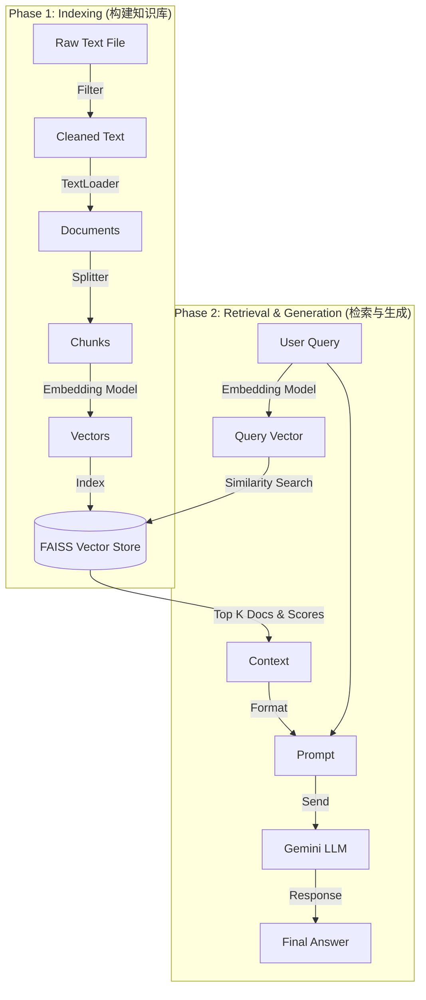

# 简单的 RAG 实现指南

本文档基于 `src/examples/retrieval/demo_retrieval1.py`，详细讲解如何利用 LangChain 实现一个简单的 RAG (Retrieval-Augmented Generation) 系统。我们将重点展示每个步骤的代码实现、调试输出（Logs），并**深度解析**每一个关键函数及其参数。

---

## 语料背景说明

本项目使用的示例文本是 **《爱比克泰德金言录》 (The Golden Sayings of Epictetus)**。

*   **作者**：爱比克泰德 (Epictetus)，古希腊著名的斯多葛学派 (Stoicism) 哲学家。
*   **内容**：核心思想是“区分我们能控制的和不能控制的”。他教导人们在面对无法改变的外部环境时，如何通过控制自己的判断来获得内心的宁静。
*   **用途**：包含大量哲理段落的非结构化文本，适合演示 RAG 如何检索智慧。

---

## 整体流程图



---

## 第一部分：构建 Vector Store

### 步骤 1: 数据准备 (Data Preparation)

获取原始文本，过滤无关内容（如版权声明），并保存为纯净的文本文件。

```python
src_doc = "src/examples/retrieval/docs/src_golden_hymns_of_epictetus.txt"
output_doc = "src/examples/retrieval/docs/output_golden_hymns_of_epictetus_new.txt"

start_saving = False
stop_saving = False
line_to_save = []

with open(src_doc, "r", encoding="utf-8") as f:
     for i, line in enumerate(f.readlines()):
         if i > 2000: break # (Demo仅读取前2000行)
         if "Are these the only works of Providence within us?" in line:
             start_saving = True
         if "*** END OF THE PROJECT GUTENBERG EBOOK THE GOLDEN SAYINGS OF EPICTETUS" in line:
             stop_saving = True
         if start_saving and not stop_saving:
             line_to_save.append(line)

logger.info("len of line_to_save:" + str(len(line_to_save)))

with open(output_doc, "w", encoding="utf-8") as f:
    f.writelines(line_to_save)
```

**真实调试输出**：
```text
INFO | len of line_to_save:1740
```
**深度代码解析**：
这一步主要使用 Python 标准库进行文件处理，不涉及 LangChain 特定函数。
*   **`open(..., encoding="utf-8")`**: 确保以 UTF-8 编码读取和写入文件，防止处理非 ASCII 字符时出现乱码。
*   **过滤逻辑**: 通过简单的字符串匹配 (`if "..." in line`) 来确定正文的起止位置。这是 RAG 流程中至关重要的 **数据清洗 (Data Cleaning)** 步骤。如果不过滤，RAG 可能会检索到版权声明等无用信息，干扰回答。

### 步骤 2: 加载数据 (Document Loading)

使用 `TextLoader` 加载文件。

```python
from langchain_community.document_loaders import TextLoader

logger.info("======= load text data to langchain============")
# 初始化加载器
loader = TextLoader(file_path=output_doc)
# 执行加载
golden_saying_content = loader.load()

logger.info("type of golden_saying_content: " + str(type(golden_saying_content)))
logger.info("len of golden_saying_content: " + str(len(golden_saying_content)))
```

**真实调试输出**：
```text
INFO | ======= load  text data to langchain============
INFO | type of golden_saying_content: <class 'list'>
INFO | len of golden_saying_content: 1
INFO | type of golden_saying_conten's first element:<class 'langchain_core.documents.base.Document'>
```
**深度代码解析**：
*   **`TextLoader(file_path)`**:
    *   **作用**: 这是 LangChain 最基础的文档加载器，用于处理纯文本文件。
    *   **参数**: `file_path` 指定了要读取的文件路径。
*   **`loader.load()`**:
    *   **作用**: 执行读取操作，返回一个包含 `Document` 对象的列表。
    *   **返回值**: `List[Document]`。对于 `TextLoader`，因为它不进行切分，所以列表里通常只有 **1 个** Document 对象，包含了整个文件的内容。
    *   **Document 对象**: 这是 LangChain 的核心数据结构，具有两个属性：
        *   `page_content`: 文件的完整文本内容字符串。
        *   `metadata`: 一个字典，默认包含 `{'source': '文件路径'}`。

### 步骤 3: 文本切分 (Text Splitting)

使用 `RecursiveCharacterTextSplitter` 将长文档切分为片段。

```python
from langchain_text_splitters import RecursiveCharacterTextSplitter

logger.info("========== chunking =============================")         
text_splitter = RecursiveCharacterTextSplitter(
    chunk_size = 1000,
    chunk_overlap = 50,
    length_function = len,
    add_start_index = True
)
texts = text_splitter.split_documents(golden_saying_content)

logger.info(texts[0]) 
```

**真实调试输出**：
```text
INFO | ========== chunking =============================
INFO | page_content='Are these the only works of Providence within us? What words suffice to\npraise or set them forth? ...' metadata={'source': 'src/examples/retrieval/docs/output_golden_hymns_of_epictetus_new.txt', 'start_index': 0}
```
**深度代码解析**：
*   **`RecursiveCharacterTextSplitter(...)`**: 这是处理通用文本的首选切分器。它按顺序尝试使用分隔符列表 `["\n\n", "\n", " ", ""]` 进行切分，目的是尽量保持段落、句子和单词的完整性。
    *   **`chunk_size=1000`**: **目标块大小**。分割器会尽量让每个块的字符数接近这个值（不超过它，除非单个词太长）。设置过小会导致上下文丢失，设置过大会超出 Embedding 模型的窗口限制。
    *   **`chunk_overlap=50`**: **重叠量**。相邻的两个块会有 50 个字符的重复内容。这非常重要，可以防止重要的关键词（如人名、概念）被切分在两个块的边界上，从而丢失上下文联系。
    *   **`length_function=len`**: 用于计算长度的函数。默认是 Python 的 `len()`（计算字符数）。如果你需要严格控制 Token 数量（如 OpenAI 的限制），可以使用 `token_counter` 函数。
    *   **`add_start_index=True`**: 是否添加起始位置索引。设置为 True 后，每个 Chunk 的 `metadata` 会增加一个 `start_index` 字段，记录该片段在原文中的位置，这对调试和引用非常有用。
*   **`text_splitter.split_documents(documents)`**:
    *   **作用**: 接收一个 Document 列表，应用上述切分规则，返回一个新的、包含更多（但更短）Document 对象的列表。

### 步骤 4: 向量化与存储 (Embedding & Indexing)

```python
from langchain_community.vectorstores import FAISS
from langchain_google_genai import GoogleGenerativeAIEmbeddings

logger.info("========== text embedding =============================")
# 1. 初始化 Embedding 模型
embedding_model = GoogleGenerativeAIEmbeddings(model="models/embedding-001")

# 2. 创建向量库
vector_store = FAISS.from_documents(
    documents=texts, 
    embedding=embedding_model
)
logger.info("========== embedding done =============================")
```

**真实调试输出**：
```text
INFO | ==========  text embedding =============================
INFO | Checking GOOGLE_API_KEY: True
INFO | ==========  embedding done =============================
```

**深度代码解析**：
*   **`GoogleGenerativeAIEmbeddings(...)`**:
    *   **作用**: LangChain 提供的 Google Gemini Embedding 接口封装。
    *   **参数 `model="models/embedding-001"`**: 指定使用的具体模型版本。这是一个专门针对语义检索优化的模型。
    *   **注意**: 此类依赖 `GOOGLE_API_KEY` 环境变量。
*   **`FAISS.from_documents(...)`**:
    *   这是一个便捷的工厂方法，它在后台执行了整个 Indexing 流程：
    1.  **Embed**: 调用 `embedding_model.embed_documents()`，将 `texts` 列表中的每个 chunk 文本转化为向量（例如 768 维的浮点数数组）。
    2.  **Index**: 初始化一个 FAISS 索引（通常是 `IndexFlatL2`），并将这些向量插入其中。
    3.  **Store**: 在内存中建立一个映射，将向量 ID 映射回原始的 Document 对象（以便检索时能返回文本内容）。
    *   **返回值**: 一个初始化好的 `FAISS` 向量库对象。

### 💡 深度解析：Embedding 模型详解

在这一步，我们使用了 `GoogleGenerativeAIEmbeddings`（基于 LLM 的 Embedding）。你可能会问，为什么不直接用简单的算法，或者直接用 Chat Model？

#### 1. 为什么要用 LLM (如 Google/OpenAI) 做 Embedding？
*   **上下文感知 (Contextual)**: LLM 基于 Transformer 架构，能理解“语境”。例如，它知道 *"Apple"* 在 *"Apple pie"*（食物）和 *"Apple Inc"*（公司）中代表完全不同的含义，并会生成不同的向量。这是传统方法（如 Word2Vec）做不到的。
*   **语义理解强**: 它们不仅仅是匹配关键词，而是真正“读懂”了句子。即使两个句子没有共同的词（如“手机没电了”和“屏幕黑了”），LLM 也能识别出它们在语义上是相关的。

#### 2. 为什么不能直接用 Chat Model (如 GPT-4, Gemini Pro) 做 Embedding？
你可能已经在用强大的 Chat Model（对话模型），为什么不能直接用它生成向量？

*   **训练目标不同**：
    *   **Chat Model (生成模型)**：目标是“预测下一个字”，它的强项是生成流畅、合逻辑的**文本**。
    *   **Embedding Model (表示模型)**：目标是“将语义压缩成向量”，它的强项是计算两个句子在数学空间上的**距离**（相似度）。
*   **输出格式不同**：
    *   Chat Model 的 API 通常只返回生成的**文本字符串**。
    *   Embedding Model 的 API 返回的是**浮点数列表**（向量）。
*   **接口限制**：虽然 Chat Model 内部也有向量（Hidden States），但绝大多数商业 API（如 OpenAI, Google）都不开放这个底层数据，只开放生成的文本。

因此，我们需要专门的 `Embedding Model` 来完成向量化工作。

#### 3. 其他 Embedding 方法对比

| 方法 | 例子 | 优点 | 缺点 |
| :--- | :--- | :--- | :--- |
| **LLM API** | Google Gemini, OpenAI | **效果最好**，无需维护模型，语义理解最强 | 需要付费/联网，数据隐私顾虑 |
| **本地模型** | HuggingFace (如 all-MiniLM) | **免费**，离线可用，数据隐私好 | 消耗本地计算资源 (CPU/GPU)，大模型跑不动 |
| **静态词向量** | Word2Vec, GloVe | 速度极快，资源消耗低 | **不懂上下文**（无法区分多义词），效果一般 |
| **统计方法** | TF-IDF, One-Hot | 简单直观，关键词匹配精准 | **稀疏向量**，完全不懂语义（不知道“开心”和“高兴”是近义词） |

**总结**：在 RAG 应用中，为了保证检索的准确性（尤其是基于自然语言的模糊搜索），**基于 LLM 或 HuggingFace Transformer 的 Embedding 是目前的标准选择**。

---

## 第二部分：基于 Vector Store 的查询

### 步骤 1: 语义检索 (Semantic Search)

手动调用检索接口并获取分数。

```python
str_query = "how can I practice mindfulness if I am always busy and distracted"

logger.info("============= query from vector store =====================")
# 执行检索
docs_and_scores = vector_store.similarity_search_with_score(query=str_query, k=10)

# 打印检索结果
for i, (doc, score) in enumerate(docs_and_scores):
    logger.info(f"[Source {i+1}] Score: {score:.4f}, Content: {doc.page_content[:50]}...")
```

**真实调试输出**：
```text
INFO | ============= query from vector store =====================
INFO | type of rs:<class 'list'> len of rs: 10
INFO | [Source 1] Score: 0.9082, Content: XXX

You must know that it is no easy thing for a ...
INFO | [Source 2] Score: 0.9529, Content: One who has had fever, even when it has left him, ...
INFO | [Source 3] Score: 0.9596, Content: _I move not without Thy knowledge!_

XXIX

Conside...
...
```
**讲解**：
*   **Score**: FAISS 默认通常使用 L2 距离（欧氏距离），**分数越低代表距离越近，即越相似**。如果是 Cosine Similarity，则分数越高越相似。这一点在解读日志时非常重要。（注：这里的 Score 0.9082 比 0.9529 小，说明 Source 1 更相似）。
*   **Content**: 打印前 50 个字符可以快速确认检索到的内容是否真的跟“正念”、“忙碌”有关。

### 步骤 2 & 3: 构建上下文并生成回答 (Generation)

```python
from langchain_core.prompts import ChatPromptTemplate
from langchain_core.output_parsers import StrOutputParser
from src.llm.gemini_chat_model import get_gemini_llm

# 1. 格式化 Context
context_parts = []
for i, (doc, score) in enumerate(docs_and_scores):
    context_parts.append(f"[Source {i+1}] (Score: {score:.4f}):\n{doc.page_content}")
formatted_context = "\n\n".join(context_parts)

# 2. 定义 Prompt
template = """Answer the question based only on the following context. 
Please cite the sources you used for your answer (e.g., [Source 1], [Source 2]).
Context: {context}
Question: {question}
"""
prompt = ChatPromptTemplate.from_template(template)

# 3. 初始化 LLM
llm = get_gemini_llm()

# 4. 构建 LCEL 链
chain = prompt | llm | StrOutputParser()

# 5. 执行链
response = chain.invoke({"context": formatted_context, "question": str_query})
logger.info(f"LLM Response:\n{response}")
```

**真实调试输出 (LLM Response)**：
```text
INFO | ============= query with llm =============================
INFO | LLM Response:
Based on the context provided, you can practice a form of mindfulness even when busy and distracted through the following methods:

*   **Reframe your perspective on your situation:** If you are alone, instead of calling it "solitude," you should call it "Tranquillity and Freedom." When in the company of many, rather than viewing it as a "wearisome crowd and tumult," consider it an "assembly and a tribunal" and accept it with contentment [Source 1].
*   **Be self-sufficient and converse with yourself:** A person should be prepared to be "sufficient unto himself—to dwell with himself alone." You should be able to converse with yourself, not need others for distraction, and direct your thoughts toward the "Divine Administration" and your relation to everything else [Source 5].
*   **Observe your inner state:** Take time to observe how past and present events have affected you, what things still have the power to hurt you, and how they might be cured or removed [Source 5].
*   **Focus on breaking mental habits:** If you have a negative habit like anger, do not feed it or give it anything that helps it increase. A practical step is to keep quiet and count the days you are successful in avoiding the negative habit [Source 2].
*   **Maintain your principles daily:** For a principle to become your own, you must maintain it each day and work it out in your life [Source 1].
*   **Shift your focus:** Rather than spending all your time calculating and contriving for profit, you are encouraged to learn about the "administration of the World," your place in it, and what constitutes your own Good and Evil [Source 4].

**Sources:**
*   [Source 5] (Score: 0.9677)
*   [Source 4] (Score: 0.9674)
*   [Source 3] (Score: 0.9596)
*   [Source 2] (Score: 0.9529)
*   [Source 1] (Score: 0.9082)
```

**深度代码解析**：
*   **`ChatPromptTemplate.from_template(template)`**:
    *   **作用**: 从字符串模板创建一个 Chat Prompt 对象。
    *   **占位符**: `{context}` 和 `{question}` 是变量，后续 `invoke` 时会自动替换。这是 Prompt Engineering 的核心，我们显式地告诉 LLM “只基于 context 回答”，这是减少幻觉的关键。
*   **`get_gemini_llm()`**:
    *   这是本项目自定义的辅助函数，用于初始化 `GeminiChatModel`。它封装了读取 Config、设置 API Key 等繁琐步骤。
*   **`LCEL (LangChain Expression Language)`**:
    *   `chain = prompt | llm | StrOutputParser()`
    *   **`|` (Pipe Operator)**: 这是 LangChain 的特色语法，类似于 Unix 管道。数据从左向右流动：
        1.  `prompt`: 接收输入字典，填充模板，生成 `PromptValue`。
        2.  `llm`: 接收 `PromptValue`，调用 Gemini API，返回 `AIMessage` 对象。
        3.  `StrOutputParser()`: 接收 `AIMessage`，提取其中的 `content` 文本字符串。
*   **`chain.invoke(...)`**:
    *   **作用**: 触发整个链条的执行。
    *   **输入**: 一个字典 `{"context": ..., "question": ...}`，必须匹配 Prompt 中的占位符。
   可以看到 LLM 成功地：
    1.  理解了问题。
    2.  阅读了我们提供的 Context。
    3.  **引用了来源** (`[Source 1]`)，这证明它确实是用我们的数据在回答，而不是在瞎编。
